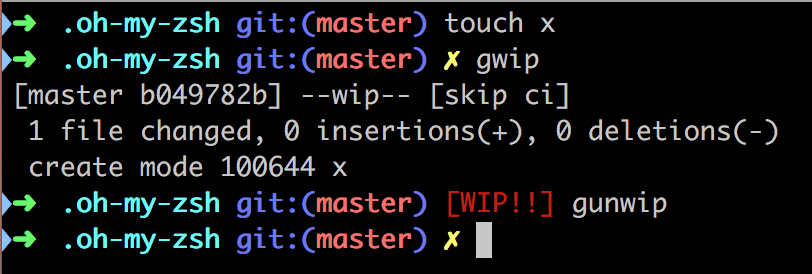

# Oh-My-Zsh robbyrussell WIP theme

Use this theme if you ❤️️️️️❤️️️️️❤️️️️️ LOVE😍 ❤️️️️️❤️️️️️❤️️️️️ the [oh-my-zsh robbyrussell theme](https://github.com/robbyrussell/oh-my-zsh/blob/master/themes/robbyrussell.zsh-theme) like I do, but desire to add output to you shell to indicate whether the latest commit in your git repo is a _WIP commit_. Useful in preventing these commits from accidentally sneaking into the `master` branch 😬



## Installation

```sh
git clone git@github.com:ecbrodie/robbyrussell-WIP-theme.git
mkdir -p $ZSH_CUSTOM/themes
cp PATH/TO/robbyrussell-WIP.zsh-theme $ZSH_CUSTOM/themes
```

And then set the theme in your `.zshrc`:

```sh
ZSH_THEME="robbyrussell-WIP"
```

You could also optionally rename the file to be a drop-in replacement of your existing `robbyrussell` theme:

```sh
mv $ZSH_CUSTOM/themes/robbyrussell-WIP.zsh-theme $ZSH_CUSTOM/themes/robbyrussell.zsh-theme
```

Finally, restart your shell to activate the new theme.

## References

Inspiration for this project came from [this blog post](https://coderwall.com/p/kbnufw/wip-git-oh-my-zsh-improve-your-branch-switching) and the [gallois theme](https://github.com/robbyrussell/oh-my-zsh/blob/master/themes/gallois.zsh-theme) it referred to.

## License

[MIT LICENSE](LICENSE) Copyright (c) 2018 Evan Brodie
